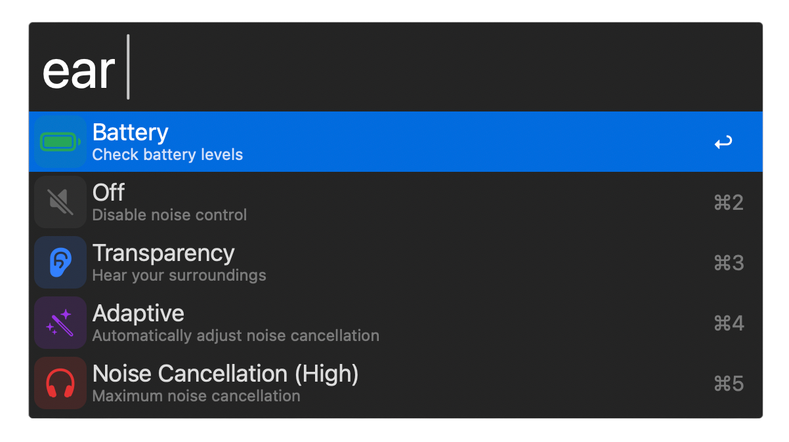

# earctl

An Alfred workflow for controlling the noise cancellation mode on **Nothing Ear 2** headphones from macOS.

> **Disclaimer:** This is an unofficial, community-made tool and is not affiliated with, endorsed by, or associated with Nothing Technology Limited in any way. "Nothing" and "Nothing Ear" are trademarks of Nothing Technology Limited.



## Features

Type `ear` in Alfred to check battery or switch between all ANC modes:

| | Description |
|-|-------------|
| **Battery** | Show battery level for each earbud |
| **Off** | Disable noise control entirely |
| **Transparency** | Let ambient sound through |
| **Noise Cancellation (High)** | Maximum noise blocking |
| **Noise Cancellation (Mid)** | Moderate noise blocking |
| **Noise Cancellation (Low)** | Light noise blocking |
| **Adaptive** | Automatically adjusts based on environment |

## Usage

1. Open Alfred (`⌘ Space` or your configured hotkey)
2. Type `ear` and press Enter to expand the mode list
3. Select a mode and press Enter — the mode changes immediately

## Requirements

- macOS 12 Monterey or later
- [Alfred 5](https://www.alfredapp.com/) with the [Powerpack](https://www.alfredapp.com/powerpack/) (required for workflows)
- Nothing Ear 2 headphones paired to your Mac via Bluetooth

> Other Nothing Ear models (Ear (1), Ear (a), CMF Buds etc.) likely use the same protocol and may work, but have not been tested.

## Installation

1. Download `NothingEar2.alfredworkflow` from this repo
2. Double-click it to import into Alfred
3. Grant Alfred Bluetooth permission — see [Troubleshooting](#alfred-doesnt-change-the-mode--nothing-happens)

## Dependencies

The CLI is written in Swift and uses only Apple frameworks — no third-party dependencies.

| Dependency | Version | Notes |
|------------|---------|-------|
| macOS | 12+ | IOBluetooth RFCOMM support |
| Swift | 5.7+ | Bundled with Xcode 14+ |
| Xcode Command Line Tools | any | Required to build |
| Alfred | 5.x | Workflow host |
| Alfred Powerpack | any | Required for workflows |

To install Xcode Command Line Tools if not already present:

```bash
xcode-select --install
```

## Building from source

```bash
# Clone the repo
git clone https://github.com/xhain/earctl
cd earctl

# Build the CLI binary
cd cli
swift build -c release
cp .build/release/nothing-ctl ../workflow/bin/nothing-ctl
cd ..

# Package the Alfred workflow
cd workflow
zip -r ../NothingEar2.alfredworkflow . -x "*.DS_Store"
cd ..
```

Then double-click `NothingEar2.alfredworkflow` to import into Alfred.

To verify the CLI works before importing:

```bash
workflow/bin/nothing-ctl battery
# → L  82%  R  79%

workflow/bin/nothing-ctl anc high
# → Noise Cancellation (High)
```

## How it works

The workflow bundles a Swift CLI tool (`nothing-ctl`) that communicates with the Nothing Ear 2 over **Classic Bluetooth RFCOMM** using macOS's IOBluetooth framework — no BLE, no third-party libraries.

The correct control channel is identified by the **NT Link service UUID** (`aeac4a03-dff5-498f-843a-34487cf133eb`) via SDP discovery, not by the service name. Commands follow the Nothing wire protocol:

```
[0x55, 0x60, 0x01, cmdH, cmdL, payloadLen, 0x00, FSN, ...payload, crc16L, crc16H]
```

CRC16/ARC (init=0xFFFF, poly=0xA001) over all bytes before the CRC. ANC is set via `CMD_SET_ANC = 0x0FF0` with a 3-byte payload `[0x01, mode, 0x00]`.

## Sources & Inspiration

- **[DaanHessen/earctl](https://github.com/DaanHessen/earctl)** — the main protocol reference; our code direction follows this closely
- **[sn99/nothing-linux](https://github.com/sn99/nothing-linux)** — protocol documentation for Nothing devices on Linux
- **[jccit/NothingEarMac](https://github.com/jccit/NothingEarMac)** — earlier macOS attempt using IOBluetooth
- **[bharadwaj-raju blog](https://bharadwaj-raju.github.io)** — write-up on the Nothing protocol

## Troubleshooting

### Alfred doesn't change the mode / nothing happens

**Alfred needs Bluetooth permission.**

1. Open **System Settings → Privacy & Security → Bluetooth**
2. Find **Alfred** in the list and make sure it's enabled
3. If Alfred isn't listed, try running the workflow once — macOS may prompt for permission

### Battery result doesn't appear

**Alfred needs notification permission.**

1. Open **System Settings → Notifications → Alfred**
2. Make sure **Allow Notifications** is on and the alert style is not **None**
3. Check that Focus / Do Not Disturb is not muting notifications

### "Nothing Ear 2 not connected"

Make sure your Nothing Ear 2 are:
- In your ears (they disconnect when in the case)
- Connected to your Mac via Bluetooth (check the menu bar)

### First run is slow

The first command after a long idle may take 2–3 seconds while the RFCOMM channel is opened. Subsequent commands are faster.

### Rebuilding after macOS update

If the binary stops working after a macOS update, rebuild and reinstall:

```bash
cd cli && swift build -c release
cp .build/release/nothing-ctl ../workflow/bin/nothing-ctl
cd ../workflow && zip -r ../NothingEar2.alfredworkflow . -x "*.DS_Store"
```

Then double-click `NothingEar2.alfredworkflow` to reimport.
